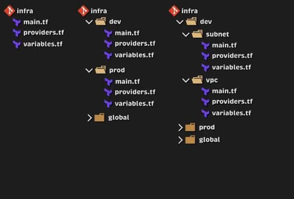
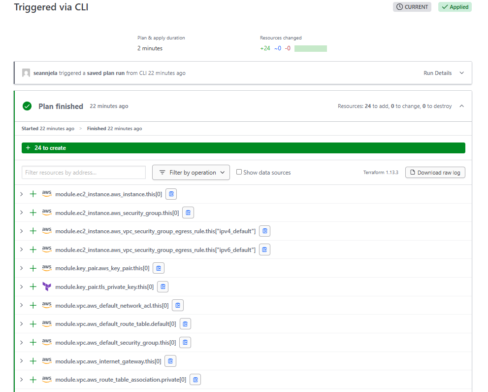

<div align="center">

  <!-- Row of icons -->
  <!--
  <p>
    
    &nbsp;&nbsp;
    
    &nbsp;&nbsp;
    
    &nbsp;&nbsp;
    
  </p>
  -->

  <h1>Project Title</h1>

  <p>
    Brief description of the project. This can include what problem it solves, the tools or technologies it showcases, or what it aims to demonstrate.
  </p>

  <p>
    <a href="https://github.com/sean-njela/docs/graphs/contributors">
    
  </a>
  <a href="">
    
  </a>
  <a href="https://github.com/sean-njela/docs/network/members">
    
  </a>
  <a href="https://github.com/sean-njela/docs/stargazers">
    
  </a>
  <a href="https://github.com/sean-njela/docs/issues/">
    
  </a>
  <a href="https://github.com/sean-njela/docs/blob/master/LICENSE">
    
  </a>
  </p>
</div>

## Table of Contents

  * [Screenshots](#screenshots)
  * [Tech Stack](#tech-stack)
  * [Prerequisites](#prerequisites)
  * [Quick Start](#quick-start)
  * [Documentation](#documentation)
  * [Features](#features)
  * [Tasks (automation)](#tasks)
  * [Roadmap](#roadmap)
  * [License](#license)
  * [Contributing](#contributing)
  * [Contact](#contact)

## Screenshots

<!-- <div align="center"> 
  
  
</div> -->

<!-- 
## Demo
<a href="https://www.example.com/">
<div align="center"> 
  
  
</div>
</a>


[](https://www.example.com/)
 -->

[▶ Watch a short demo](assets/demo-video-small.mp4)

## Tech Stack

> List of tools used in the project


## Prerequisites

> This project uses [Devbox](https://www.jetify.com/devbox/) to manage the development environment. Devbox provides a consistent, isolated environment with all the necessary CLI tools pre-installed.

0. **Install Docker**

   - Follow the [installation instructions](https://docs.docker.com/get-docker/) for your operating system.

> The rest of the tools are already installed in the devbox environment

1. **Install Devbox**

   - Follow the [installation instructions](https://www.jetify.com/devbox/docs/installing_devbox/) for your operating system.

2. **Clone the Repository**

   ```bash
   git clone https://github.com/your-username/your-repo.git
   cd your-repo
   ```

3. **Start the Devbox Environment and poetry environment**

   ```bash
   devbox shell # Start the devbox environment (this will also start the uv environment)
   ```
> Note - The first time you run `devbox shell`, it will take a few minutes to install the necessary tools. But after that it will be much faster.

## Quick Start

```bash
task setup

task status # check if everything is running

# GIVE EVERYTHING A MINUTE TO SETUP THEN
task dev
```

## Documentation

For full documentation, setup instructions, and architecture details, visit the [docs](docs/index.md) or run:

```bash
# Option 1
task docs

# Or if you prefer the docker version:
# Option 2
task docs-docker

# ONLY RUN ONE OF THE ABOVE
```

Docs are then available at: [http://127.0.0.1:8030/]()

## Features

* Feature 1
* Feature 2
* Feature 3

## Tasks

> This project is designed for a simple, one-command setup. All necessary actions are orchestrated through `Taskfile.yml`.

```bash
task setup # setup the environment
task dev # automated local provisioning
task cleanup-dev # cleanup the dev environment
```

### Git Workflow with Git Flow

The `Taskfile.gitflow.yml` provides a structured Git workflow using Git Flow. This helps in managing features, releases, and hotfixes in a standardized way. To run these tasks just its the same as running any other task. Using gitflow is optional.

```bash
task init                 # Initialize Git Flow with 'main', gh-pages and 'develop'
task sync                 # Sync current branch with latest 'develop' and handle main updates
task release:finish       # Finishes and publishes a release (merges, tags, pushes). e.g task release:finish version="1.2.0"
```

To see all tasks:

```bash
task --list-all
```

If you do not want the gitflow tasks, you can remove the `Taskfile.gitflow.yml` file and unlink it from the `Taskfile.yml` file (remove the `includes` section). If you cannot find the section use CTRL + F to search for `Taskfile.gitflow.yml`.

## NOTES

> Important notes to remember whilst using the project

## Troubleshooting

For comprehensive troubleshooting, refer to the [Troubleshooting](docs/3-troubleshooting/overview.md) section. Or open the github pages [here](https://your-username.github.io/docs/3-troubleshooting/overview.md) and use the search bar to search your issue (USE INDIVIDUAL KEYWORDS NOT THE ISSUE NAME). 

## Roadmap

* [x] Feature A
* [ ] Feature B
* [ ] Feature C

## Contributing

<a href="https://github.com/your-username/your-repo/graphs/contributors">
  
</a>

> Contributions welcome! Open an issue or submit a PR.

## License

Distributed under the MIT License. See `LICENSE` for more info.

## Contact

Your Name – [@linkedin](https://linkedin.com/in/yourlinkedin) – [@twitter/x](https://x.com/yourtwitter) – [your.email@example.com](mailto:your.email@example.com)

Project Link: [https://github.com/your-username/your-repo](https://github.com/your-username/your-repo)

About Me - [About Me](docs/4-about/about.md)


