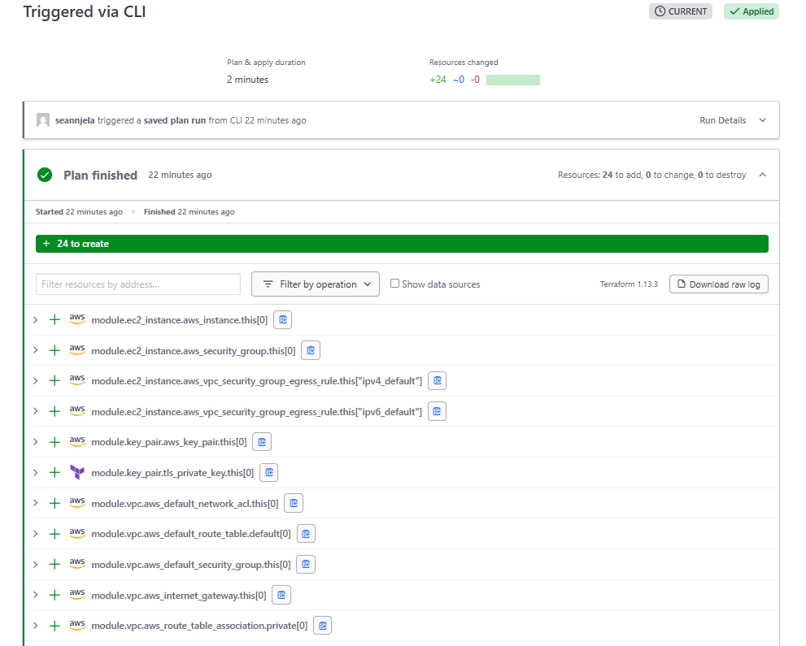

# Setup

The effective folder structure:

```bash
.
├── terraform/
│   └── envs/                     # Environment-specific configurations
│       ├── dev/
│       │   ├── main.tf           # Calls upstream modules (VPC, RDS, ECS, etc.)
│       │   ├── backend.tf        # Remote backend config (state isolation)
│       │   ├── variables.tf      # Variable definitions for this env
│       │   ├── providers.tf      # Provider config (AWS,GCP,AZURE) per env
│       │   └── dev.tfvars        # Only immutable, non-sensitive defaults
│       ├── staging/              # Mirrors dev; used for integration tests
│       └── prod/                 # Mirrors staging; stricter quotas and policies
│
├── versions.tf               # Locks Terraform & provider versions
├── .tflint.hcl               # Linting rules
├── .checkov.yml              # Static security analysis rules
├── .infracost.yml            # Cost estimation config
├── .pre-commit-config.yaml   # Developer hygiene hooks
├── .trivyignore              # Ignore rules for container scans
└── README.md                 # Explains repo usage and structure
```

### 2. Modules in practice

#### 2.1 Direct call pattern (`envs/prod/main.tf` abridged)

```hcl
# VPC
module "vpc" {
  source  = "terraform-aws-modules/vpc/aws"  # Official module
  version = "~> 6.0"                          # Pin MAJOR, allow patch/minor upgrades
  name    = "${var.service}-vpc"
  cidr    = var.cidr_block

  # Take first 3 AZs to spread resources
  azs     = slice(data.aws_availability_zones.available.names, 0, 3)

  public_subnets  = var.public_subnets
  private_subnets = var.private_subnets

  enable_nat_gateway = true
  tags = local.tags
}

# RDS
module "db" {
  source  = "terraform-aws-modules/rds/aws"
  version = "~> 6.12"
  identifier = "${var.service}-db"

  engine         = "postgres"
  engine_version = "16.2"
  instance_class = "db.t4g.medium"
  subnet_ids     = module.vpc.private_subnets
  multi_az       = true                     # Highly available
  backup_retention_period = 7
  deletion_protection     = true            # Safety guard

  username = var.db_user
  password = data.aws_secretsmanager_secret_version.db_pwd.secret_string
  tags     = local.tags
}

# ECS
module "ecs" {
  source  = "terraform-aws-modules/ecs/aws"
  version = "~> 5.13"
  cluster_name   = "${var.service}-${var.environment}"
  capacity_providers = ["FARGATE", "FARGATE_SPOT"]

  services = {
    web = {
      cpu    = 512
      memory = 1024
      desired_count = 2

      # Container definition encoded as JSON
      container_definitions = jsonencode([{
        name  = "web"
        image = "${var.image}@${var.image_digest}"

        portMappings = [{ containerPort = 8080 }]

        secrets = [
          { name = "DB_URL", valueFrom = module.db.secret_arn }
        ]

        environment = [
          { name = "SPRING_PROFILES_ACTIVE", value = var.environment }
        ]
      }])

      load_balancer = {
        target_group_arn = module.ecs.alb_target_group_arns["web"]
      }
    }
  }
  tags = local.tags
}
```

Rationale:

- Call upstream modules directly and pin versions.
- Inject secrets via ARN, never plaintext
- Use locals for tagging consistency.


> Rule of thumb: wrap if you need mandatory tags or guard-rails; never fork – you’ll lose the upstream upgrades.
>

### 3. Remote backend recipes

#### Terraform Cloud (simplest)

```hcl
terraform {
  backend "remote" {
    organization = "acme-solo"
    workspaces { name = "webapp-prod" }
  }
}
```

**Pros**: simplest setup, state encryption managed.
**Cons**: paid tier may be needed for policies.

#### S3 + DynamoDB (fully OSS)

```hcl
terraform {
  backend "s3" {
    bucket         = "acme-terraform-state" # must exist beforehand
    key            = "prod/terraform.tfstate"
    region         = "eu-central-1"
    dynamodb_table = "terraform-locks"      # provides locking
    encrypt        = true                   # SSE-KMS recommended
  }
}
```
*Create the bucket/table **once** manually or via an isolated bootstrap stack.*
**Pros**: fully OSS, no SaaS dependency.
**Cons**: requires manual bootstrap of bucket + table.

### 4. `versions.tf`

```hcl
terraform {
  required_version = "~> 1.9"         # June 2025 LTS
  required_providers {
    aws = {
      source  = "hashicorp/aws"
      version = "~> 6.0"
    }
  }
}
```

Commit the generated `terraform.lock.hcl` so CI is deterministic.

### 5. Security defaults

| Layer | Setting |
| --- | --- |
| **IAM** | GitHub OIDC ⇒ short-lived role; no static keys on laptops |
| **State** | SSE-KMS on S3 / workspace-level encryption on TF Cloud |
| **Transit** | TLS 1.2+ only (`aws_lb_listener` default) |
| **Data** | RDS storage + backups encrypted • automatic minor-version upgrades |
| **Secrets** | Stored in AWS Secrets Manager; injected by ARN, never in plain vars |
| **Static analysis** | Pre-commit hook: `terraform fmt → tflint → tfsec → checkov` |
| **Policy as code** | Sentinel / OPA rules (e.g. deny public S3) – add when compliance rises |

### 6. GitHub Actions pipeline (`.github/workflows/terraform.yml`)

```yaml
name: Terraform

on:
  pull_request:
    paths: ["terraform/**"]

permissions: { id-token: write, contents: read }

jobs:
  validate:
    runs-on: ubuntu-latest
    steps:
      - uses: actions/checkout@v4
      - uses: hashicorp/setup-terraform@v3
      - run: terraform fmt -check -recursive
      - run: terraform init -backend-config="envs/${{ github.head_ref }}/backend.hcl"
      - run: terraform validate

  plan:
    needs: validate
    runs-on: ubuntu-latest
    steps:
      - uses: actions/checkout@v4
      - uses: hashicorp/setup-terraform@v3
      - run: terraform init -backend-config="envs/${{ github.head_ref }}/backend.hcl"
      - run: terraform plan -out=tfplan
      - uses: actions/upload-artifact@v4
        with: { name: tfplan, path: tfplan }

  apply:
    if: github.event.pull_request.merged == true
    environment: prod        # requires manual approval gate
    needs: plan
    runs-on: ubuntu-latest
    steps:
      - uses: actions/checkout@v4
      - uses: hashicorp/setup-terraform@v3
      - run: terraform init -backend-config="envs/prod/backend.hcl"
      - run: terraform apply -auto-approve tfplan
```
Design notes:

- OIDC → AWS role assumption. No long-lived keys.
- Manual approval enforced by GitHub environments.
- Plans are generated on PR, applied only after merge.

### 7. Local developer ergonomics

- **`make deploy ENV=dev`** – wraps `terraform init`/`plan`/`apply`.
- **Direnv** – autoloads environment variables (`AWS_PROFILE`, region).
- **.pre-commit-config.yaml** – keeps style & security on every commit:

```yaml
repos:
  - repo: https://github.com/antonbabenko/pre-commit-terraform
    rev: v1.79.0
    hooks:
      - id: terraform_fmt
      - id: terraform_validate
      - id: tflint
      - id: tfsec
      - id: checkov

```

### 8. Cost & drift guard-rails

| Tool | Schedule | Action |
| --- | --- | --- |
| **Infracost** | On every PR | Shows monthly delta in comment |
| **`terraform plan`** | Nightly GitHub Action | Exit code 2 ⇒ Slack/Email alert |
| **AWS Budgets** | 80 % of monthly limit | Sends SNS → Slack |

### 9. Scaling & failure-proofing checklist

[] Multi-AZ: ALBs, RDS, subnets across ≥ 2 AZs.

[] Auto-scaling: ECS services with Fargate Spot + CPU/latency metrics.

[] Backups: RDS retention 7 days, cross-region snapshot copy.

[] Observability: CloudWatch dashboards/alarms. Add Prometheus/Grafana if needed.

[] Deployments: ECS rolling updates. Optionally add CodeDeploy for blue-green.

### 10. Upgrade workflow

- Review release notes of each module.

- Bump version pin in branch.

- Run terraform init -upgrade in dev.

- Validate plan.

- Merge → pipeline applies to staging and prod with gate.

*(You usually only do this quarterly; the community publishes clear guides.)*

### 11. When this template stops being enough

| Scenario | Next step |
| --- | --- |
| Multiple squads or > 3 prod environments | Introduce Terragrunt or a platform (Spacelift/Scalr) for DRY-er roots |
| Heavy compliance (PCI/HIPAA, audit trails) | Add OPA/Sentinel CI gates, Service Control Policies, AWS Control Tower |
| Multi-cloud or edge workloads | Look at CDK for Terraform or Crossplane to abstract vendors |

### TL;DR printable checklist

- [ ]  One **mono-repo** with `envs/` for each environment
- [ ]  **Remote state** secured & versioned
- [ ]  Use **`terraform-aws-modules/*`** directly, pinned to major versions
- [ ]  OIDC → **no static AWS keys**
- [ ]  **Pre-commit**: fmt, validate, tflint, tfsec, checkov
- [ ]  **GitHub Actions** plan on PR, apply on merge with manual prod gate
- [ ]  Encrypt & tag **everything**; secrets via Secrets Manager
- [ ]  Nightly **drift** plan + Infracost + Budget alerts

## Using the Template in dev/prod

Each environment is isolated in its own directory under `envs/`. You always `cd` into that environment’s directory before running Terraform. This ensures state, variables, and backends remain separate.

### 1. Backend configuration

#### `envs/dev/backend.tf`

```hcl
terraform {
  backend "s3" {
    bucket         = "acme-terraform-state"
    key            = "dev/terraform.tfstate"  # path unique to dev
    region         = "eu-central-1"
    dynamodb_table = "terraform-locks"
    encrypt        = true
  }
}
```

#### `envs/prod/backend.tf`

```hcl
terraform {
  backend "s3" {
    bucket         = "acme-terraform-state"
    key            = "prod/terraform.tfstate" # path unique to prod
    region         = "eu-central-1"
    dynamodb_table = "terraform-locks"
    encrypt        = true
  }
}
```

### 2. Main module calls

Both `main.tf` files are structurally the same. They call upstream modules but parameterise with environment-specific variables.

#### `envs/dev/main.tf`

```hcl
module "vpc" {
  source  = "terraform-aws-modules/vpc/aws"
  version = "~> 6.0"

  name    = "dev-vpc"
  cidr    = var.cidr_block
  azs     = slice(data.aws_availability_zones.available.names, 0, 2)

  public_subnets  = var.public_subnets
  private_subnets = var.private_subnets

  enable_nat_gateway = false   # cheaper for dev
  tags = local.tags
}
```

#### `envs/prod/main.tf`

```hcl
module "vpc" {
  source  = "terraform-aws-modules/vpc/aws"
  version = "~> 6.0"

  name    = "prod-vpc"
  cidr    = var.cidr_block
  azs     = slice(data.aws_availability_zones.available.names, 0, 3)

  public_subnets  = var.public_subnets
  private_subnets = var.private_subnets

  enable_nat_gateway = true    # HA and scaling for prod
  tags = local.tags
}
```

### 3. Variables

#### `envs/dev/dev.tfvars`

```hcl
service        = "webapp"
environment    = "dev"
cidr_block     = "10.0.0.0/16"
public_subnets = ["10.0.1.0/24"]
private_subnets= ["10.0.101.0/24"]
db_user        = "devuser"
```

#### `envs/prod/prod.tfvars`

```hcl
service        = "webapp"
environment    = "prod"
cidr_block     = "10.1.0.0/16"
public_subnets = ["10.1.1.0/24", "10.1.2.0/24", "10.1.3.0/24"]
private_subnets= ["10.1.101.0/24", "10.1.102.0/24", "10.1.103.0/24"]
db_user        = "produser"
```

Secrets (passwords, keys) must not be stored in `*.tfvars`. Use Secrets Manager or SSM.

### 4. Commands

#### For development

```bash
cd envs/dev
terraform init
terraform plan -var-file=dev.tfvars
terraform apply -var-file=dev.tfvars
```

#### For production

```bash
cd envs/prod
terraform init
terraform plan -var-file=prod.tfvars
terraform apply -var-file=prod.tfvars
```

### Key notes

* Each `backend.tf` ensures state isolation per environment.
* Each `*.tfvars` file holds only **immutable** config (CIDRs, naming, sizes), never secrets.
* Resource behaviour differs per environment (e.g. NAT disabled in dev, enabled in prod).
* CI/CD can switch `cd envs/<env>` based on branch or workflow input.

## Secrets

Secrets are never checked into the repo. Terraform only **references** them at runtime from a managed secret store. Provisioning works by:

## 1. Store the secret

### Example: database password in **AWS Secrets Manager**

```bash
aws secretsmanager create-secret \
  --name db/webapp/prod/password \
  --secret-string 'SuperStrongPassword123!'
```

or for **SSM Parameter Store** (encrypted with KMS):

```bash
aws ssm put-parameter \
  --name /db/webapp/prod/password \
  --value 'SuperStrongPassword123!' \
  --type SecureString
```

### 2. Reference secret in Terraform

### Using Secrets Manager

```hcl
# Fetch the latest version of the secret
data "aws_secretsmanager_secret_version" "db_pwd" {
  secret_id = "db/webapp/${var.environment}/password"
}

module "db" {
  source  = "terraform-aws-modules/rds/aws"
  version = "~> 6.12"

  identifier             = "${var.service}-db"
  engine                 = "postgres"
  username               = var.db_user
  password               = data.aws_secretsmanager_secret_version.db_pwd.secret_string
  # other RDS inputs...
}
```

### Using SSM Parameter Store

```hcl
data "aws_ssm_parameter" "db_pwd" {
  name = "/db/webapp/${var.environment}/password"
  with_decryption = true
}

module "db" {
  source  = "terraform-aws-modules/rds/aws"
  version = "~> 6.12"

  identifier = "${var.service}-db"
  username   = var.db_user
  password   = data.aws_ssm_parameter.db_pwd.value
}
```

### 3. Access control

* Terraform execution role (from GitHub Actions OIDC or developer IAM role) must have **read-only permission** for that secret. Example IAM policy:

```json
{
  "Version": "2012-10-17",
  "Statement": [
    {
      "Effect": "Allow",
      "Action": [
        "secretsmanager:GetSecretValue",
        "ssm:GetParameter"
      ],
      "Resource": [
        "arn:aws:secretsmanager:eu-central-1:123456789012:secret:db/webapp/*",
        "arn:aws:ssm:eu-central-1:123456789012:parameter/db/webapp/*"
      ]
    }
  ]
}
```

### 4. Provisioning flow

* Secrets created once manually or by a bootstrap script.
* Terraform plan/apply runs. It pulls the secret value dynamically from AWS.
* RDS or ECS module consumes it as input.
* The secret never enters Git history, `.tfvars`, or CI logs.

### 5. Runtime injection into workloads

Example with ECS:

```hcl
container_definitions = jsonencode([{
  name  = "web"
  image = var.image
  secrets = [
    { name = "DB_PASSWORD", valueFrom = data.aws_secretsmanager_secret.db_pwd.arn }
  ]
}])
```

ECS injects the secret into the container environment at runtime.

### Recommended “cookie-cutter” starting point

**Pick → [`terramate-io/terramate-quickstart-aws`](https://github.com/terramate-io/terramate-quickstart-aws)**.

Among the public, maintained starters it is the only one that already folds in **all** the must-haves we listed earlier while still staying light enough for one engineer.

| Built-in item | Status in template |
| --- | --- |
| **Remote state** (S3 + DynamoDB) | Pre-wired |
| **OIDC GitHub → AWS** | Pre-wired |
| **CI/CD GitOps pipeline** | GitHub Actions plans → PR approval → auto-apply |
| **Drift detection** | Scheduled GitHub Action + Slack/PR comment |
| **Multi-env / multi-account** | `stg` + `prd` stacks out of the box |
| **Pre-commit** (`tflint`, `tfsec`, `checkov`) | Included |
| **Scaffolded VPC, NAT, LB, compute layer** | VPC + sample EKS; easy to swap to ECS/Lambda |
| **Change-detection orchestration** | Terramate change-sets (so plans only run where code changed) |
| **Terraform/OpenTofu compatible** | Yes |

## Setting Things up

The following is the reference arhitecture that we will be deploying with Terraform:


We First create an IAM user and configure the aws cli:

```sh
aws configure
```

We are using terraform cloud backend.

We initialise the terraform backend by stating the `terraform {}` block in the `backend.tf`.

Then we `terraform login` and create a token to be used on the cli.

Since we are using Terraform Cloud:

We use Terraform Cloud → AWS OIDC dynamic credentials. Steps:

### Create the OIDC identity provider in AWS

1. Open IAM → Identity providers → Add provider → OpenID Connect.
2. Set Provider URL to `https://app.terraform.io` without trailing slash.
3. Set Audience to `aws.workload.identity`.
4. Save and note the provider ARN.

### Create the IAM role the workspace will assume

1. Create a new role → Web identity → Select the OIDC provider you created.
2. Workspace Run → this is the correct option for standard Terraform Cloud workspaces.3. Attach these permissions policy for the AWS resources Terraform must manage. (For prod attach stricter policies):


This restricts the token to the exact organisation, project, and workspace. Use `run_phase => *` if one role is shared by plan and apply. Create two roles if plan and apply need different permissions and set `run_phase -> plan` or `run_phase => apply`.

### Add variables in the Terraform Cloud workspace

1. In Workspace → Variables, add environment variables:

   * `TFC_AWS_PROVIDER_AUTH=true`
   * `TFC_AWS_RUN_ROLE_ARN=arn:aws:iam::...`
   * Optionally `AWS_REGION=<region>` if not set in the provider block.
   * Optionally `TFC_AWS_PLAN_ROLE_ARN` and `TFC_AWS_APPLY_ROLE_ARN` if using separate roles.
2. Use a Variable Set if multiple workspaces share the role.

### Keep the provider block minimal in each environment

`envs/dev/providers.tf`:

```hcl
provider "aws" {
  region = "eu-central-1"  # or omit and set AWS_REGION in workspace vars
  default_tags {
    tags = {
      environment = "dev"
      service     = var.service
    }
  }
}
```

No access keys. No profiles. Terraform Cloud injects short-lived credentials at run time.

### Run the workspace

1. Trigger a plan in Terraform Cloud.
2. Confirm the run log shows dynamic credentials in use and no IMDS lookups.
3. Apply after review.

### Troubleshooting

* “No valid credential sources found” means the workspace variables are missing or the trust policy does not match the token. Fix the variables or the `sub` conditions.

* “Invalid audience” means the trust policy expects a different `aud`. Set `app.terraform.io:aud` to `aws.workload.identity` or match your custom audience.

* Access denied during plan or apply means the role’s permissions policy is too narrow. Add the exact actions Terraform needs and re-plan.

### Security notes

* Lock the trust policy to the specific organisation, project, and workspace to prevent cross-org token reuse.

* Prefer separate roles for plan and apply to enforce read-only during plan if required.

* Use IAM Access Analyzer to validate the trust policy.

* Avoid static keys in Terraform Cloud entirely.

We then apply the configuration in the `terraform/envs/dev` folder:

```sh
task tf-apply-dev
```

We then check what was provisioned in Terraform Cloud:



We then destroy the infrastructure:

```sh
task tf-destroy-dev
```

