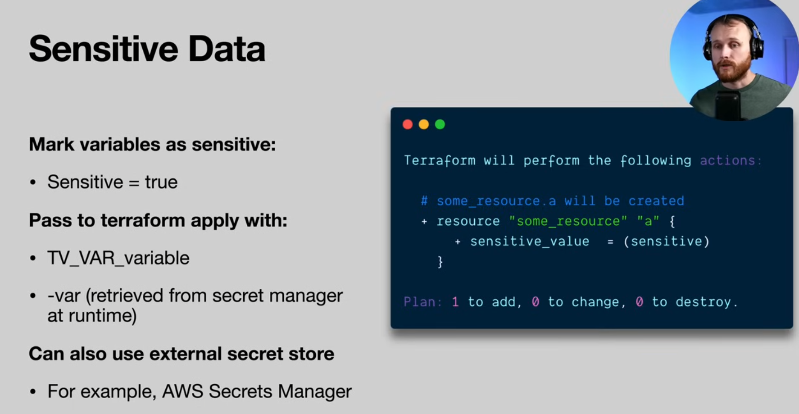

# Terraform Essentials for DevOps

### Core Blocks

These are the most important Terraform configuration blocks for DevOps tasks:

- **`provider`**

Defines the infrastructure platform (e.g., AWS, Azure, GCP).

- **`resource`**

Provisions infrastructure components like servers, databases, and networks.

- **`variable`**

Declares input values to parameterise configurations.

- **`output`**

Exposes values (like IP addresses, URLs) after deployment.

- **`module`**

Organises and reuses Terraform configurations for better structure and DRY code.


- **`locals`**

Defines local values to simplify expressions and avoid repetition.


### Sometimes Used

- **`data`**

Retrieves existing resources from the provider (e.g., latest AMI, existing VPC).

- **`terraform`**

Configures backend settings (e.g., for remote state storage with S3, GCS).

### Resource vs Module 

When to use which:

- If you want fine-grained control or need something not covered by a module → use provider resources directly from the AWS provider docs.

- If you want faster, standardised setups (VPC, RDS, ECS, S3) → use the terraform-aws-modules modules, pinned to a version.

### Data Types

Terraform supports several variable types. Below is a complete list with examples.

#### **Primitive Types**

- **string**
   Text values.

   ```hcl
   variable "instance_type" {
     type    = string
     default = "t2.micro"
   }
   ```

- **number**
   Integers or floats.

   ```hcl
   variable "instance_count" {
     type    = number
     default = 3
   }
   ```

- **bool**
   Boolean values (`true` or `false`).

   ```hcl
   variable "enable_monitoring" {
     type    = bool
     default = true
   }
   ```

#### **Collection Types**

- **list(<TYPE>)**
   Ordered sequence of values of the same type.

   ```hcl
   variable "availability_zones" {
     type    = list(string)
     default = ["us-east-1a", "us-east-1b"]
   }
   ```

- **set(<TYPE>)**
   Unordered collection of unique values of the same type.

   ```hcl
   variable "security_groups" {
     type    = set(string)
     default = ["sg-12345", "sg-67890"]
   }
   ```

- **map(<TYPE>)**
   Key-value pairs with keys as strings and values of the same type.

   ```hcl
   variable "tags" {
     type = map(string)
     default = {
       Environment = "dev"
       Owner       = "team-a"
     }
   }
   ```

#### **Structural Types**

- **object({...})**
   Group of named attributes, each with its own type.

   ```hcl
   variable "server_config" {
     type = object({
       name     = string
       cpu      = number
       memory   = number
       priority = bool
     })
     default = {
       name     = "webserver"
       cpu      = 2
       memory   = 4096
       priority = true
     }
   }
   ```

- **tuple([...])**
   Sequence of elements where each position can have a different type.

   ```hcl
   variable "db_info" {
     type = tuple([string, number, bool])
     default = ["mysql", 3306, true]
   }
   ```

#### **Special Types**

- **any**
   Accepts any type. Not recommended for strict validation.

   ```hcl
   variable "raw_input" {
     type = any
   }
   ```

Terraform variable names must use **letters, digits, and underscores** only.

* Valid:

  ```hcl
  variable "instance_type" {}
  variable "db_user1" {}
  variable "enable_logging" {}
  ```

* Invalid (will cause an error):

  ```hcl
  variable "instance-type" {}   # hyphens not allowed
  variable "db-user" {}
  ```

Hyphens (`-`) are only allowed in the values or **resource names**, not in variable identifiers.

## Terraform Cheat Sheet

### Provider

Defines the cloud or infrastructure platform.

```hcl
provider "aws" {
    region = var.aws_region
}

```

### Resource

Creates and manages infrastructure components.

```hcl
resource "aws_instance" "web" {
    ami           = var.ami_id
    instance_type = var.instance_type
    tags = {
    Name = "web-server"
    }
}

```

### Variable

Allows configuration reuse and customization.

```hcl
variable "instance_type" {
    type    = string
    default = "t2.micro"
}

```

Usage:

```hcl
instance_type = var.instance_type

```

### Output

Exposes values after deployment.

```hcl
output "web_ip" {
    value = aws_instance.web.public_ip
}

```

### Module

Organises and reuses configuration.

```hcl
module "vpc" {
    source = "./modules/vpc"
    cidr   = var.vpc_cidr
}

```

### Locals

Simplifies logic and avoids repetition.

```hcl
locals {
    subnet_cidrs = [
    cidrsubnet(var.vpc_cidr, 8, 1),
    cidrsubnet(var.vpc_cidr, 8, 2),
    ]
}

```

### Data Source

Pulls in external or existing infrastructure.

```hcl
data "aws_ami" "ubuntu" {
    most_recent = true
    owners      = ["099720109477"]
    filter {
    name   = "name"
    values = ["ubuntu/images/hvm-ssd/ubuntu-focal-20.04-amd64-server-*"]
    }
}

```

### Terraform Block

Configures version and remote state settings.

```hcl
terraform {
    required_version = ">= 1.0.0"
    backend "s3" {
    bucket         = "tf-state-bucket"
    key            = "prod/terraform.tfstate"
    region         = "eu-west-1"
    dynamodb_table = "tf-lock"
    }
}

```

### Quick Glossary

| Block | Purpose |
| --- | --- |
| `provider` | Defines infrastructure platform |
| `resource` | Creates/manages infra components |
| `variable` | Declares configurable values |
| `output` | Exposes outputs from applied infrastructure |
| `module` | Reuses organized code modules |
| `locals` | Stores computed values for reuse |
| `data` | Fetches existing resources |
| `terraform` | Configures backend and versioning |

### DevOps Pro Tips

- Use **remote state** with locking in team settings (`terraform` block).
- Break infrastructure into **modules** for reuse and clarity.
- Always **pin versions** of Terraform and providers.
- Use `data` to **avoid bloating state** with existing infra.
- Apply **consistent naming** for better collaboration.


Version 3 - Each TF module in its own git repo with versioning (typical repo name: `terraform-{provider}-{module}` (e.g `terraform-aws-vpc`).

Then inside you would have the normal TF files → main, variables, outputs, versions, etc.

Then, after git commit, you `git tag x.x.x`, then push with `-- tags`. Now, in the main of each module, reference the git link with the tag as a source in the module resource

When changes are made to the module, push with a new version number. This can get cumbersome if there are too many repo modules so it's best to use reuseable modules across the microservices.


## My current Stack

### Local Development

| Layer | Tool/Component | Purpose |
| --- | --- | --- |
| **Local Backend** | `terraform cloud` backend | Stores Terraform state files for isolated development. |
| **Workspaces** | Terraform Workspaces | Manages multiple environments (e.g., dev, test) within the same config. |
| **Mock Providers** | LocalStack, Docker | Simulates cloud services locally for testing without incurring costs. |
| **Testing Framework** | Terratest or `terraform plan` in CI | Facilitates automated testing of Terraform modules and configurations. |
| **Linting & Formatting** | `tflint`, `terraform fmt` | Ensures code quality and adherence to best practices. |

### Production

| Layer | Tool/Component | Purpose |
| --- | --- | --- |
| **Remote Backend** | S3 + DynamoDB (AWS) or Terraform Cloud (free tier) | Stores state files remotely with locking and versioning capabilities. |
| **Version Control** | GitHub, GitLab | Manages infrastructure code and enables collaboration. |
| **CI/CD Integration** | GitHub Actions | Automates testing and deployment of infrastructure changes. |
| **Secrets Management** | AWS Secrets Manager | Secures sensitive information used in configurations. |
| **Policy Enforcement** | OPA (with Conftest) | Enforces compliance and governance policies on infrastructure changes. |
| **Monitoring & Alerts** | Basic CloudWatch / Prometheus exporters | Monitors infrastructure health and performance. |

## Terraform Command Cheat Sheet

### Initialisation and Setup

```bash
terraform init            # Initialise working directory, install providers, configure backend
terraform init -upgrade   # Upgrade provider plugins
terraform workspace list  # List workspaces
terraform workspace new <name>  # Create new workspace
terraform workspace select <name>  # Switch workspace
```

### Validation and Formatting

```bash
terraform fmt             # Auto-format .tf files
terraform validate        # Validate syntax and internal consistency
terraform providers       # List providers required by configuration
```

### Planning

```bash
terraform plan                          # Show execution plan
terraform plan -out=tfplan              # Save plan to file
terraform show tfplan                   # Show saved plan in human-readable form
terraform show -json tfplan > plan.json # Output plan in JSON
```

### Applying

```bash
terraform apply                         # Apply with interactive approval
terraform apply -auto-approve           # Apply without prompt
terraform apply tfplan                  # Apply previously saved plan
```

### Destroying

```bash
terraform destroy                       # Destroy managed infrastructure
terraform destroy -target=aws_instance.my_vm  # Destroy specific resource
```

### State Management

```bash
terraform state list                    # List resources in state
terraform state show <resource>         # Show details of one resource
terraform state rm <resource>           # Remove resource from state
terraform state mv <src> <dst>          # Move resource in state
terraform refresh                       # Sync state with real infrastructure
```

### Importing

```bash
terraform import <resource> <id>        # Import existing infra into state
```

### Output

```bash
terraform output                        # Show all outputs
terraform output <name>                 # Show specific output
terraform output -json                  # JSON output
```

### Graphing

```bash
terraform graph | dot -Tpng > graph.png # Generate dependency graph
```
In Terraform, **modules** are reusable units of configuration. A module is just a directory containing `.tf` files.

## Modules

Terraform always has at least two levels:

* **Root module** → the directory where you run `terraform init/plan/apply`.
* **Child modules** → any module blocks referenced from the root (or other child) modules.

### 1. Why use modules?

* Reuse across projects and environments.
* Standardise infrastructure (network, IAM, compute).
* Reduce duplication by passing variables.
* Enforce best practices by versioning modules in a registry.

### 2. Structure of a basic module

Example: `modules/network/`

```
modules/
└── network/
    ├── main.tf
    ├── variables.tf
    ├── outputs.tf
```

* `main.tf` → resources
* `variables.tf` → input variables
* `outputs.tf` → exported values

### 3. Calling a module

From your root module:

```hcl
module "vpc" {
  source = "./modules/network"  # local path, Git URL, or registry
  cidr_block = "10.0.0.0/16"
  name       = "dev-vpc"
}
```

### 4. Sources

Modules can be sourced from:

* **Local path**

  ```hcl
  source = "./modules/network"
  ```
* **Terraform Registry**

  ```hcl
  source  = "terraform-aws-modules/vpc/aws"
  version = "5.0.0"
  ```
* **Git repo**

  ```hcl
  source = "git::https://github.com/your-org/tf-modules.git//network?ref=v1.0.0"
  ```

### 5. Variables and outputs

#### Inside module (`variables.tf`):

```hcl
variable "cidr_block" {
  type        = string
  description = "VPC CIDR block"
}

variable "name" {
  type        = string
  description = "Name for the VPC"
}
```

#### Inside module (`outputs.tf`):

```hcl
output "vpc_id" {
  value = aws_vpc.main.id
}
```

#### In root module:

```hcl
module "vpc" {
  source     = "./modules/network"
  cidr_block = "10.0.0.0/16"
  name       = "dev-vpc"
}

output "vpc_id" {
  value = module.vpc.vpc_id
}
```

### 6. Meta-arguments with modules

Modules accept:

* `count`
* `for_each`
* `depends_on`
* `providers`

Example:

```hcl
module "vpcs" {
  source = "./modules/network"
  for_each = {
    dev  = "10.0.0.0/16"
    prod = "10.1.0.0/16"
  }
  cidr_block = each.value
  name       = each.key
}
```

### 7. Best practices

* Keep modules **small and focused** (e.g. `network`, `iam`, `compute`).
* Use versioned modules from a Git repo or Terraform Registry.
* Do not put provider blocks inside child modules (pass providers from root).
* Expose only useful outputs.
* Keep modules stateless: no hardcoded values.
* Test modules in isolation before reusing.

### 8. Risks

* Over-abstraction: too many generic variables makes modules hard to use.
* Provider inside module causes provider conflicts.
* Sensitive values passed through outputs are exposed in state.
* If using `count`/`for_each`, resource addressing can break on refactor.

There are Terraform modules that can spin up **entire cloud setups**, not just single resources.

### 1. **Community / Official Modules**

* **Terraform AWS Modules** ([terraform-aws-modules](https://github.com/terraform-aws-modules)):
  These are well-maintained, production-grade modules for AWS. Examples:

  * [`terraform-aws-modules/vpc/aws`](https://registry.terraform.io/modules/terraform-aws-modules/vpc/aws/latest) → full VPC setup (subnets, routing, NAT, IGW).
  * [`terraform-aws-modules/eks/aws`](https://registry.terraform.io/modules/terraform-aws-modules/eks/aws/latest) → fully working EKS (Kubernetes) cluster with node groups, IAM roles, and networking.
  * [`terraform-aws-modules/ec2-instance/aws`](https://registry.terraform.io/modules/terraform-aws-modules/ec2-instance/aws/latest) → full EC2 provisioning with security groups, IAM, etc.

These modules can be combined to form a **complete infrastructure** (network + compute + IAM).

### 2. **Stacks and Blueprints**

Vendors and open-source projects publish **stacks** (collections of modules) that bring up entire environments.

* **Gruntwork IaC Library** (commercial) → prebuilt modules covering VPC, ECS, EKS, CI/CD, Vault, Consul.
* **Cloud Posse** modules ([cloudposse](https://github.com/cloudposse)) → composable modules that can build entire AWS org structures.
* **HashiCorp AWS Reference Architecture** ([terraform-aws-landing-zone](https://github.com/hashicorp/terraform-aws-landing-zone)) → starting point for a full AWS account structure.

### 3. **Cloud-Native Reference Projects**

* **AWS Control Tower + Terraform** → sets up a multi-account AWS org with logging, guardrails, SSO.
* **Google Cloud Foundation Toolkit (CFT)** → Terraform modules for complete GCP environments.
* **Azure Landing Zones** (Enterprise Scale) → modules for identity, networking, governance.

### 4. **DIY Patterns**

You can also wire modules together for a full cloud setup:

* Root module defines environments (`dev`, `staging`, `prod`).
* Includes child modules:

  * `network` (VPC, subnets, routes)
  * `security` (IAM roles, policies, KMS)
  * `compute` (EKS, ECS, or EC2)
  * `storage` (S3, RDS, DynamoDB)
* One `terraform apply` spins up a ready-to-use environment.

### Trade-offs

* **Pros**: Fast bootstrap, proven patterns, less boilerplate.
* **Cons**: Opinionated (you inherit module defaults), dependency management between large modules can be messy, risk of “black box” complexity.

## Passing sensitive values



In Terraform, **sensitive variables** are values that should not be displayed in plaintext in logs, CLI output, or state files where possible. They are used for things like passwords, API keys, secrets, etc.

### How to declare a sensitive variable

```hcl
variable "db_password" {
  description = "Database password"
  type        = string
  sensitive   = true
}
```

When `sensitive = true`:

* Terraform CLI masks the value with `"sensitive"` in outputs.
* `terraform plan` and `terraform apply` will not print the value.
* However, the **raw value still exists** in the Terraform state file (`terraform.tfstate`).

### Using sensitive variables in modules

```hcl
module "db" {
  source      = "./modules/db"
  db_password = var.db_password
}
```

### Sensitive outputs

```hcl
output "db_password" {
  value     = var.db_password
  sensitive = true
}
```

This prevents the output from being shown in the CLI unless you explicitly request it:

```bash
terraform output db_password        # masked
terraform output -json db_password  # reveals raw value
```

### Sources for sensitive values

* **Environment variables**

  ```bash
  export TF_VAR_db_password="supersecret"
  terraform apply
  ```

* **.tfvars file** (never commit this):

  ```hcl
  db_password = "supersecret"
  ```

* **Terraform Cloud / Workspaces** → set as workspace variables, marked *sensitive*.
* **Secret managers** (recommended): inject from AWS Secrets Manager, Vault, or SSM via data sources.

### Limitations

* Sensitive values **still exist in `terraform.tfstate`**. Anyone with access to state storage can read them.
* To mitigate, always use a **remote backend** (e.g. S3 + DynamoDB, Terraform Cloud, Vault).
* Sensitive only prevents accidental exposure in CLI/logs, **not storage**.

### Best practices

1. Mark all secrets (`passwords`, `API keys`, `tokens`) as `sensitive = true`.
2. Never commit `.tfvars` with secrets to git.
3. Store secrets in secret managers or inject via pipelines.
4. Protect state files: encrypt in S3, restrict access, or use Terraform Cloud.
5. Use `prevent_destroy` lifecycle for critical resources that depend on secrets.

## Meta Arguments

In Terraform, **meta-arguments** are special arguments you can add to *any* resource or module block. They control Terraform’s behaviour, not the resource itself. They are evaluated by Terraform Core before provider logic.

### Common Meta-Arguments

#### 1. **`count`**

Create multiple instances of a resource.

```hcl
resource "aws_instance" "example" {
  count = 3
  ami   = "ami-123456"
  type  = "t2.micro"
}
```

Accessible via index:

```hcl
aws_instance.example[0].id
```

#### 2. **`for_each`**

Iterate over a map or set of strings. More flexible than `count`.

```hcl
resource "aws_s3_bucket" "b" {
  for_each = toset(["logs", "images", "data"])
  bucket   = "myapp-${each.key}"
}
```

Access: `aws_s3_bucket.b["logs"].id`

#### 3. **`provider`**

Choose a specific provider configuration (useful for multi-region/multi-account).

```hcl
provider "aws" {
  alias  = "us_west"
  region = "us-west-2"
}

resource "aws_instance" "west" {
  provider = aws.us_west
  ami      = "ami-789012"
  type     = "t2.micro"
}
```

#### 4. **`depends_on`**

Force explicit dependency when Terraform cannot infer it automatically.

```hcl
resource "aws_instance" "app" {
  ami           = "ami-123456"
  type          = "t2.micro"
  depends_on    = [aws_s3_bucket.logs]
}
```

#### 5. **`lifecycle`**

Fine-tune create/update/destroy behaviour.

```hcl
resource "aws_s3_bucket" "state" {
  bucket = "terraform-state"

  lifecycle {
    prevent_destroy = true       # disallow destroy
    create_before_destroy = true # replacement strategy
    ignore_changes = [tags]      # ignore drift on tags
  }
}
```

#### 6. **`provisioner`** (not recommended for production)

Run local or remote scripts after create/destroy.

```hcl
resource "aws_instance" "app" {
  provisioner "local-exec" {
    command = "echo ${self.public_ip} >> hosts"
  }
}
```

Better to use config management tools (Ansible, cloud-init).

#### 7. **`connection`** (used with provisioners)

Define how to connect to the resource.

```hcl
connection {
  type     = "ssh"
  user     = "ec2-user"
  host     = self.public_ip
  private_key = file("~/.ssh/id_rsa")
}
```

### At Module Level

Modules also support meta-arguments:

* `count`
* `for_each`
* `depends_on`
* `providers`

Example:

```hcl
module "network" {
  source = "./modules/network"
  for_each = {
    dev  = "10.0.0.0/16"
    prod = "10.1.0.0/16"
  }
  cidr_block = each.value
}
```

### Best Practices

* Prefer `for_each` over `count` for clarity (works with maps and stable addressing).
* Use `depends_on` sparingly—most dependencies are inferred automatically.
* Always use `lifecycle.prevent_destroy = true` for critical resources like state buckets.
* Avoid provisioners unless no other option exists.

## Testing

Terraform supports **automated testing**, but not traditional "unit tests" like in application code. Testing Terraform usually means validating configuration, planning, and applying against real or mocked infrastructure.

### 1. **Built-in validation**

* `terraform validate` → checks syntax and internal references.
* `terraform plan` → dry-run to see what changes will be applied.
* These catch obvious issues, but not logic errors or infrastructure behaviour.

### 2. **Unit-style testing with mocks**

* **Terraform plan + JSON output** can be parsed and validated.

  ```bash
  terraform plan -out=tfplan
  terraform show -json tfplan > plan.json
  ```

  You can then assert expected resources with tools like `jq` or custom scripts.

* **Terratest (Go library)** → industry standard for Terraform testing.

  * Uses Go’s testing framework.
  * Can spin up infrastructure, run assertions (e.g. check an EC2 instance is reachable), and then destroy it.
  * Example:

    ```go
    func TestTerraformAwsExample(t *testing.T) {
      terraformOptions := &terraform.Options{
        TerraformDir: "../examples/aws",
      }
      defer terraform.Destroy(t, terraformOptions)
      terraform.InitAndApply(t, terraformOptions)
      vpcId := terraform.Output(t, terraformOptions, "vpc_id")
      assert.NotEmpty(t, vpcId)
    }
    ```

### 3. **Policy and compliance tests**

* **Terraform Cloud / Sentinel** → policy as code (enforce rules before apply).
* **Open Policy Agent (OPA) / Conftest** → test `.tf` or `.json` plans against compliance rules.
  Example: ensure all S3 buckets have encryption enabled.

### 4. **Integration / End-to-End testing**

* Run Terraform in CI/CD (GitHub Actions, GitLab, Jenkins).
* Pipeline stages:

  1. `terraform fmt -check`
  2. `terraform validate`
  3. `terraform plan -detailed-exitcode` (fail if unexpected changes)
  4. Optional: apply in a sandbox account → run **integration tests** (ping services, check IAM roles, etc.) → destroy.

### 5. **Specialised tools**

* **Checkov** (by Bridgecrew) → static analysis for Terraform (security/compliance).
* **TFLint** → linter for Terraform, validates provider-specific rules.
* **InSpec + Kitchen-Terraform** → integration testing for infra after deployment.

### Best Practice Testing Strategy

* **Pre-commit** → `terraform fmt`, `terraform validate`, `tflint`, `checkov`.
* **CI/CD (unit-ish)** → run `terraform plan`, parse JSON, assert expected resources.
* **Integration (sandbox env)** → deploy infra, test with Terratest/pytest, destroy.
* **Compliance** → enforce policies via Sentinel or OPA.

## Using Atlantis

Atlantis is a **self-hosted Terraform automation tool** for pull-request workflows. It listens to Git webhooks, runs Terraform commands, and posts results back to PRs.

* Source: [https://www.runatlantis.io](https://www.runatlantis.io)
* Works with **GitHub, GitLab, Bitbucket, Azure Repos**.

### Core Workflow

1. Developer opens PR with Terraform changes.
2. Atlantis auto-runs `terraform plan`.
3. Atlantis posts the plan as a PR comment.
4. Reviewer approves.
5. Someone comments `atlantis apply`.
6. Atlantis runs `terraform apply` from its server.
7. PR merges after infra changes succeed.

### Supported Commands (commented in PR)

* `atlantis plan`

  * Runs `terraform plan` in the repo/directory/workspace.
* `atlantis apply`

  * Runs `terraform apply`.
* `atlantis plan -d dir -w workspace`

  * Run plan in specific directory/workspace.
* `atlantis apply -d dir -w workspace`

  * Apply only for a subset.
* `atlantis unlock`

  * Unlock a stuck plan.

### Setup Requirements

* Atlantis server (binary, Docker, Helm chart).
* Git provider integration: webhook + bot user/token.
* Access to Terraform backend (S3/DynamoDB, GCS, etc).
* IAM/credentials mounted into Atlantis container/VM.

### Global Config (`repos.yaml`)

Controls allowed repos and workflows. Example:

```yaml
repos:
- id: github.com/myorg/*
  apply_requirements: [approved, mergeable]
  workflow: default
  allowed_overrides: [workflow]
  allow_custom_workflows: true
```

### Repo Config (`atlantis.yaml`)

Defines projects and workflows for a repo. Example:

```yaml
version: 3
projects:
- name: staging
  dir: terraform/staging
  workspace: staging
- name: prod
  dir: terraform/prod
  workspace: prod

workflows:
  custom:
    plan:
      steps:
        - init
        - plan:
            extra_args: ["-lock=false"]
    apply:
      steps:
        - apply
```

### Key Features

* **ChatOps style** (trigger via PR comments).
* **Multi-project support** (`atlantis.yaml` can define many dirs/workspaces).
* **Approval gates** (require PR approval before `apply`).
* **Policy controls** (`apply_requirements`: approved, mergeable, etc).
* **Custom workflows** (inject `tflint`, `checkov`, `pre-commit`).
* **Locking** (prevents concurrent applies).
* **Audit trail** (all plans/applies tied to PRs and users).

### Best Practices

* Run Atlantis in a **dedicated environment** (Kubernetes, EC2, GCP VM).
* Use **Terraform remote state** (S3+DynamoDB, GCS, Terraform Cloud).
* Store **credentials securely** (vault, IRSA, workload identity).
* Define projects in `atlantis.yaml` to prevent running in the whole repo accidentally.
* Use **custom workflows** for linting, policy checks, security scans.
* Require PR approvals before `atlantis apply`.

### Pros / Cons

**Pros:**

* Open-source, self-hosted, free.
* Strong GitOps workflow.
* Easy collaboration (all plans visible in PRs).
* Extensible via workflows.

**Cons:**

* Self-hosted → you manage upgrades, security, HA.
* Single-server bottleneck unless scaled.
* Limited UI (PR comments only).
* Doesn’t manage secrets → you handle via env/volumes.

### Alternatives

* **Terraform Cloud / Enterprise** → SaaS, policy engine, built-in secrets.
* **Spacelift** → commercial, strong GitOps + policies.
* **Env0, Scalr** → similar to Atlantis but SaaS-based.
* **DIY pipelines** → GitHub Actions, GitLab CI running Terraform manually.

### Useful Commands Cheat

Inside PR:

```bash
atlantis plan                  # plan default project
atlantis apply                 # apply default project
atlantis plan -d terraform/dev # plan only in terraform/dev
atlantis apply -w prod         # apply only in prod workspace
atlantis unlock                # unlock stuck project
```

### Debugging

* Logs live in Atlantis server container/VM.
* Failed applies often caused by missing credentials or state lock.
* Use `--log-level debug` when running Atlantis for troubleshooting.
