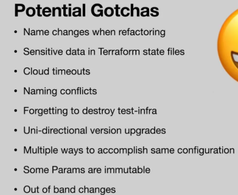
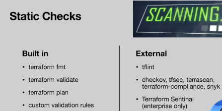

# Terraform Essentials for DevOps

### Core Blocks

These are the most important Terraform configuration blocks for DevOps tasks:

- **`provider`**

Defines the infrastructure platform (e.g., AWS, Azure, GCP).

- **`resource`**

Provisions infrastructure components like servers, databases, and networks.

- **`variable`**

Declares input values to parameterise configurations.

- **`output`**

Exposes values (like IP addresses, URLs) after deployment.

- **`module`**

Organises and reuses Terraform configurations for better structure and DRY code.


- **`locals`**

Defines local values to simplify expressions and avoid repetition.


### Sometimes Used

- **`data`**

Retrieves existing resources from the provider (e.g., latest AMI, existing VPC).

- **`terraform`**

Configures backend settings (e.g., for remote state storage with S3, GCS).

### Resource vs Module 

When to use which:

- If you want fine-grained control or need something not covered by a module → use provider resources directly from the AWS provider docs.

- If you want faster, standardised setups (VPC, RDS, ECS, S3) → use the terraform-aws-modules modules, pinned to a version.

### Data Types

Terraform supports several variable types. Below is a complete list with examples.

#### **Primitive Types**

- **string**
   Text values.

   ```hcl
   variable "instance_type" {
     type    = string
     default = "t2.micro"
   }
   ```

- **number**
   Integers or floats.

   ```hcl
   variable "instance_count" {
     type    = number
     default = 3
   }
   ```

- **bool**
   Boolean values (`true` or `false`).

   ```hcl
   variable "enable_monitoring" {
     type    = bool
     default = true
   }
   ```

#### **Collection Types**

- **list(<TYPE>)**
   Ordered sequence of values of the same type.

   ```hcl
   variable "availability_zones" {
     type    = list(string)
     default = ["us-east-1a", "us-east-1b"]
   }
   ```

- **set(<TYPE>)**
   Unordered collection of unique values of the same type.

   ```hcl
   variable "security_groups" {
     type    = set(string)
     default = ["sg-12345", "sg-67890"]
   }
   ```

- **map(<TYPE>)**
   Key-value pairs with keys as strings and values of the same type.

   ```hcl
   variable "tags" {
     type = map(string)
     default = {
       Environment = "dev"
       Owner       = "team-a"
     }
   }
   ```

#### **Structural Types**

- **object({...})**
   Group of named attributes, each with its own type.

   ```hcl
   variable "server_config" {
     type = object({
       name     = string
       cpu      = number
       memory   = number
       priority = bool
     })
     default = {
       name     = "webserver"
       cpu      = 2
       memory   = 4096
       priority = true
     }
   }
   ```

- **tuple([...])**
   Sequence of elements where each position can have a different type.

   ```hcl
   variable "db_info" {
     type = tuple([string, number, bool])
     default = ["mysql", 3306, true]
   }
   ```

#### **Special Types**

- **any**
   Accepts any type. Not recommended for strict validation.

   ```hcl
   variable "raw_input" {
     type = any
   }
   ```

Terraform variable names must use **letters, digits, and underscores** only.

* Valid:

  ```hcl
  variable "instance_type" {}
  variable "db_user1" {}
  variable "enable_logging" {}
  ```

* Invalid (will cause an error):

  ```hcl
  variable "instance-type" {}   # hyphens not allowed
  variable "db-user" {}
  ```

Hyphens (`-`) are only allowed in the values or **resource names**, not in variable identifiers.

## Terraform Cheat Sheet

### Provider

Defines the cloud or infrastructure platform.

```hcl
provider "aws" {
    region = var.aws_region
}

```

### Resource

Creates and manages infrastructure components.

```hcl
resource "aws_instance" "web" {
    ami           = var.ami_id
    instance_type = var.instance_type
    tags = {
    Name = "web-server"
    }
}

```

### Variable

Allows configuration reuse and customization.

```hcl
variable "instance_type" {
    type    = string
    default = "t2.micro"
}

```

Usage:

```hcl
instance_type = var.instance_type

```

### Output

Exposes values after deployment.

```hcl
output "web_ip" {
    value = aws_instance.web.public_ip
}

```

### Module

Organises and reuses configuration.

```hcl
module "vpc" {
    source = "./modules/vpc"
    cidr   = var.vpc_cidr
}

```

### Locals

Simplifies logic and avoids repetition.

```hcl
locals {
    subnet_cidrs = [
    cidrsubnet(var.vpc_cidr, 8, 1),
    cidrsubnet(var.vpc_cidr, 8, 2),
    ]
}

```

### Data Source

Pulls in external or existing infrastructure.

```hcl
data "aws_ami" "ubuntu" {
    most_recent = true
    owners      = ["099720109477"]
    filter {
    name   = "name"
    values = ["ubuntu/images/hvm-ssd/ubuntu-focal-20.04-amd64-server-*"]
    }
}

```

### Terraform Block

Configures version and remote state settings.

```hcl
terraform {
    required_version = ">= 1.0.0"
    backend "s3" {
    bucket         = "tf-state-bucket"
    key            = "prod/terraform.tfstate"
    region         = "eu-west-1"
    dynamodb_table = "tf-lock"
    }
}

```

### Quick Glossary

| Block | Purpose |
| --- | --- |
| `provider` | Defines infrastructure platform |
| `resource` | Creates/manages infra components |
| `variable` | Declares configurable values |
| `output` | Exposes outputs from applied infrastructure |
| `module` | Reuses organized code modules |
| `locals` | Stores computed values for reuse |
| `data` | Fetches existing resources |
| `terraform` | Configures backend and versioning |

### DevOps Pro Tips

- Use **remote state** with locking in team settings (`terraform` block).
- Break infrastructure into **modules** for reuse and clarity.
- Always **pin versions** of Terraform and providers.
- Use `data` to **avoid bloating state** with existing infra.
- Apply **consistent naming** for better collaboration.


Version 3 - Each TF module in its own git repo with versioning (typical repo name: `terraform-{provider}-{module}` (e.g `terraform-aws-vpc`).

Then inside you would have the normal TF files → main, variables, outputs, versions, etc.

Then, after git commit, you `git tag x.x.x`, then push with `-- tags`. Now, in the main of each module, reference the git link with the tag as a source in the module resource

When changes are made to the module, push with a new version number. This can get cumbersome if there are too many repo modules so it's best to use reuseable modules across the microservices.




## My current Stack

### Local Development

| Layer | Tool/Component | Purpose |
| --- | --- | --- |
| **Local Backend** | `terraform cloud` backend | Stores Terraform state files for isolated development. |
| **Workspaces** | Terraform Workspaces | Manages multiple environments (e.g., dev, test) within the same config. |
| **Mock Providers** | LocalStack, Docker | Simulates cloud services locally for testing without incurring costs. |
| **Testing Framework** | Terratest or `terraform plan` in CI | Facilitates automated testing of Terraform modules and configurations. |
| **Linting & Formatting** | `tflint`, `terraform fmt` | Ensures code quality and adherence to best practices. |

### Production

| Layer | Tool/Component | Purpose |
| --- | --- | --- |
| **Remote Backend** | S3 + DynamoDB (AWS) or Terraform Cloud (free tier) | Stores state files remotely with locking and versioning capabilities. |
| **Version Control** | GitHub, GitLab | Manages infrastructure code and enables collaboration. |
| **CI/CD Integration** | GitHub Actions | Automates testing and deployment of infrastructure changes. |
| **Secrets Management** | AWS Secrets Manager | Secures sensitive information used in configurations. |
| **Policy Enforcement** | OPA (with Conftest) | Enforces compliance and governance policies on infrastructure changes. |
| **Monitoring & Alerts** | Basic CloudWatch / Prometheus exporters | Monitors infrastructure health and performance. |

## Terraform Command Cheat Sheet

### Initialisation and Setup

```bash
terraform init            # Initialise working directory, install providers, configure backend
terraform init -upgrade   # Upgrade provider plugins
terraform workspace list  # List workspaces
terraform workspace new <name>  # Create new workspace
terraform workspace select <name>  # Switch workspace
```

### Validation and Formatting

```bash
terraform fmt             # Auto-format .tf files
terraform validate        # Validate syntax and internal consistency
terraform providers       # List providers required by configuration
```

### Planning

```bash
terraform plan                          # Show execution plan
terraform plan -out=tfplan              # Save plan to file
terraform show tfplan                   # Show saved plan in human-readable form
terraform show -json tfplan > plan.json # Output plan in JSON
```

### Applying

```bash
terraform apply                         # Apply with interactive approval
terraform apply -auto-approve           # Apply without prompt
terraform apply tfplan                  # Apply previously saved plan
```

### Destroying

```bash
terraform destroy                       # Destroy managed infrastructure
terraform destroy -target=aws_instance.my_vm  # Destroy specific resource
```

### State Management

```bash
terraform state list                    # List resources in state
terraform state show <resource>         # Show details of one resource
terraform state rm <resource>           # Remove resource from state
terraform state mv <src> <dst>          # Move resource in state
terraform refresh                       # Sync state with real infrastructure
```

### Importing

```bash
terraform import <resource> <id>        # Import existing infra into state
```

### Output

```bash
terraform output                        # Show all outputs
terraform output <name>                 # Show specific output
terraform output -json                  # JSON output
```

### Graphing

```bash
terraform graph | dot -Tpng > graph.png # Generate dependency graph
```
